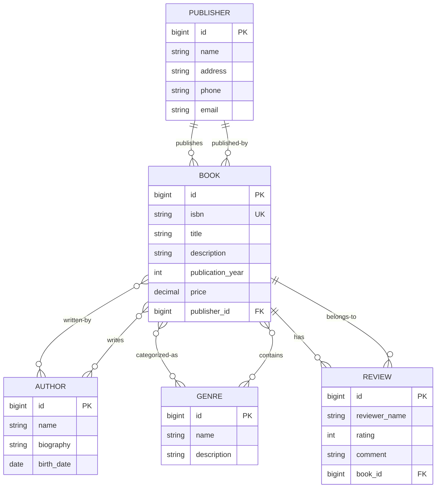

# Электронный каталог книг
## REST API проект на Java, Spring Boot, Maven

**Electronic Book Catalog** — учебное Spring Boot приложение, представляющее REST API для управления каталогом книг. Финальная цель: полноценный backend-сервис с подключением к БД, реализующий операции просмотра, поиска, сортировки и управления каталогом книг.

**Текущий статус**: реализованы получение полного каталога, различные запросы, in-memory индекс на основе `HashMap<K, V>`.

## Задачи

1. Реализовать SPA-клиент (React/Angular/Vue и т.д.).
2. Клиент должен работать с API, реализованным в лабораторных работах.
3. Отобразить связи OneToMany и ManyToMany.
4. Реализовать CRUD операции и фильтрацию.

- [SonarCloud](https://sonarcloud.io/project/overview?id=xenia777666_Electronic-Book-Catalog)
- [Swagger UI](http://localhost:8080/swagger-ui/index.html#/)

## ER-диаграмма базы данных

