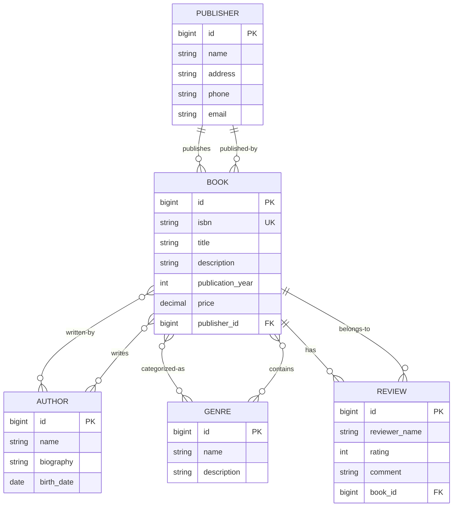

# Электронный каталог книг
## REST API проект на Java, Spring Boot, Maven

**Electronic Book Catalog** — учебное Spring Boot приложение, представляющее REST API для управления каталогом книг. Финальная цель: полноценный backend-сервис с подключением к БД, реализующий операции просмотра, поиска, сортировки и управления каталогом книг.

**Текущий статус**: реализованы получение полного каталога, различные запросы, in-memory индекс на основе `HashMap<K, V>`.

## Задачи

1. **Реализовать bulk-операцию** (POST со списком объектов) с бизнес-смыслом
2. **Использовать Stream API и Optional** в сервисном слое
3. **Обеспечить транзакционность** bulk-операции:
   - Продемонстрировать работу **с/без `@Transactional`**
   - Показать разницу в состоянии БД
4. **Написать unit-тесты** для сервисов (Mockito)

- [SonarCloud](https://sonarcloud.io/project/overview?id=xenia777666_Electronic-Book-Catalog)
- [Swagger UI](http://localhost:8080/swagger-ui/index.html#/)

## API endpoints

### ✅ Успешная bulk-операция
```http
POST http://localhost:8080/api/books/bulk
```
**Body**:
```json
[
  {
    "isbn": "9785041111111",
    "title": "Bulk книга 1",
    "price": 500.00,
    "publisherId": 1,
    "authorIds": [1]
  },
  {
    "isbn": "9785042222222",
    "title": "Bulk книга 2",
    "price": 600.00,
    "publisherId": 1,
    "authorIds": [1]
  }
]
```

### ❌ Bulk-операция (ошибка) **без транзакции**
```http
POST http://localhost:8080/api/books/bulk/without-transaction
```
**Body** 
```json
[
  {
    "isbn": "9785012344444",
    "title": "Первая книга",
    "price": 500.00,
    "publisherId": 1,
    "authorIds": [1]
  },
  {
    "isbn": "9785042222222",
    "title": "Вторая книга (дубликат)",
    "price": 500.00,
    "publisherId": 1,
    "authorIds": [1]
  }
]
```

### ❌ Bulk-операция (ошибка) **с транзакцией**
```http
POST http://localhost:8080/api/books/bulk/with-transaction
```
**Body** 
```json
[
  {
    "isbn": "9785012344444",
    "title": "Первая книга",
    "price": 500.00,
    "publisherId": 1,
    "authorIds": [1]
  },
  {
    "isbn": "9785042222222",
    "title": "Вторая книга (дубликат)",
    "price": 500.00,
    "publisherId": 1,
    "authorIds": [1]
  }
]
```

## ER-диаграмма базы данных

