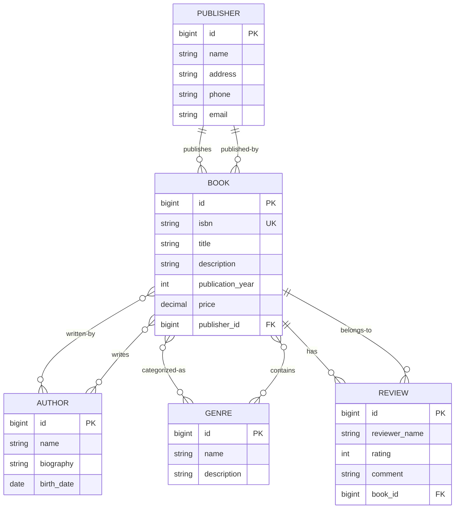

# Электронный каталог книг
## REST API проект на Java, Spring Boot, Maven

**Electronic Book Catalog** — учебное Spring Boot приложение, представляющее REST API для управления каталогом книг. Финальная цель: полноценный backend-сервис с подключением к БД, реализующий операции просмотра, поиска, сортировки и управления каталогом книг.

**Текущий статус**: реализованы получение полного каталога, различные запросы, in-memory индекс на основе `HashMap<K, V>`.

## Задачи

1. Реализовать асинхронную бизнес-операцию через @Async / CompletableFuture, которая:
- возвращает ID задачи
- позволяет проверить статус выполнения
2. Реализовать потокобезопасный счётчик (или аналогичный механизм) с использованием synchronized или Atomic.
3. Продемонстрировать возможный race condition (ExecutorService 50+ потоков) и его решение.
4. Провести нагрузочное тестирование JMeter и показать результаты.

- [SonarCloud](https://sonarcloud.io/project/overview?id=xenia777666_Electronic-Book-Catalog)
- [Swagger UI](http://localhost:8080/swagger-ui/index.html#/)

## API endpoints

### ✅ Асинхронная операция
```http
POST http://localhost:8080/api/tasks
```

### Проверка статуса операции по id
```http
GET http://localhost:8080/api/tasks/.
```

### Демонстрация race-condition
```http
GET http://localhost:8080/api/race-condition/race-demo?threads=1000&incrementsPerThread=10000
```


## ER-диаграмма базы данных

