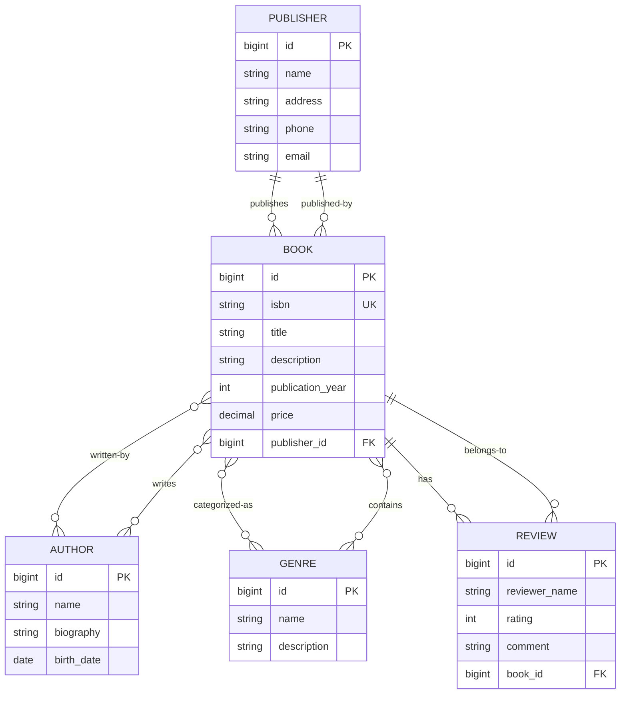

# Электронный каталог книг
## REST API проект на Java, Spring Boot, Maven

**Electronic Book Catalog** — учебное Spring Boot приложение, представляющее REST API для управления каталогом книг. Финальная цель: полноценный backend-сервис с подключением к БД, реализующий операции просмотра, поиска, сортировки и управления каталогом книг.

**Текущий статус**: реализованы получение полного каталога, различные запросы, in-memory индекс на основе `HashMap<K, V>`.

## Задачи

1. Подготовить Dockerfile для приложения.
2. Подготовить Docker Compose (приложение + БД).
3. Использовать переменные окружения.
4. Разместить приложение на бесплатном хостинге (PaaS).
5. Настроить CI/CD в GitHub:
- сборка
- тесты
- развертывание
- healthcheck

- [SonarCloud](https://sonarcloud.io/project/overview?id=xenia777666_Electronic-Book-Catalog)
- [Swagger UI](http://localhost:8080/swagger-ui/index.html#/)
- [Render](https://dashboard.render.com/blueprint/exs-d81kbn0g4nts7385v1l0)

### Запуск приложения + PostgreSQL через Docker Compose

```bash
docker compose up --build
```

После запуска API доступно на `http://localhost:8080`, healthcheck:

- `http://localhost:8080/actuator/health`

## Бесплатный PaaS (Render)

В репозитории добавлен `render.yaml` (Blueprint), который поднимает:

- web-сервис из `Dockerfile`
- PostgreSQL базу данных
- переменные окружения из managed database
- health check endpoint `/actuator/health`

Шаги:

1. Подключить репозиторий в Render.
2. Создать сервис по Blueprint (`render.yaml`).
3. Проверить публичный URL и сохранить health endpoint (например, `https://<app>.onrender.com/actuator/health`).

## CI/CD (GitHub Actions)

### `.github/workflows/ci-cd.yml`

Последовательные джобы: **build** → **test** → **deploy** → **healthcheck**.

- **build**: Maven package без тестов, сборка Docker-образа
- **test**: `mvn verify`, SonarCloud (если задан `SONAR_TOKEN`)
- **deploy**: POST на Render Deploy Hook (только `push` в `main`/`master` или ручной `workflow_dispatch`)
- **healthcheck**: пауза и проверка `actuator/health` по URL из секрета

На **pull request** выполняются только **build** и **test**.

Нужно добавить GitHub Secrets:

- `RENDER_DEPLOY_HOOK_URL` — Deploy Hook URL из Render
- `RENDER_HEALTHCHECK_URL` — полный URL health endpoint
- `SONAR_TOKEN` — опционально для SonarCloud шага

## ER-диаграмма базы данных


```mermaid
erDiagram
    PUBLISHER ||--o{ BOOK : publishes
    BOOK }o--|| PUBLISHER : "published-by"
    
    BOOK }o--o{ AUTHOR : "written-by"
    AUTHOR }o--o{ BOOK : writes
    
    BOOK }o--o{ GENRE : "categorized-as"
    GENRE }o--o{ BOOK : contains
    
    BOOK ||--o{ REVIEW : has
    REVIEW }o--|| BOOK : "belongs-to"

    PUBLISHER {
        bigint id PK
        string name
        string address
        string phone
        string email
    }

    BOOK {
        bigint id PK
        string isbn UK
        string title
        string description
        int publication_year
        decimal price
        bigint publisher_id FK
    }

    AUTHOR {
        bigint id PK
        string name
        string biography
        date birth_date
    }

    GENRE {
        bigint id PK
        string name
        string description
    }

    REVIEW {
        bigint id PK
        string reviewer_name
        int rating
        string comment
        bigint book_id FK
    }
```