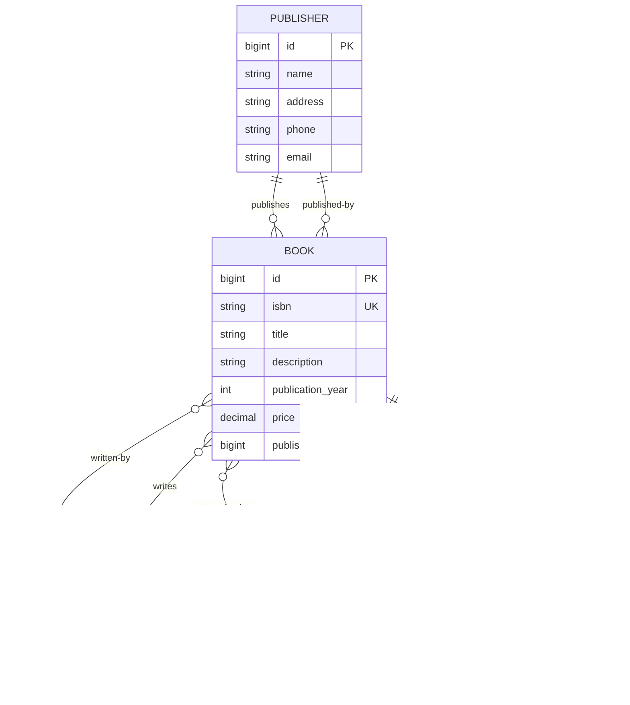

# Электронный каталог книг
## REST API проект на Java, Spring Boot, Maven

**Electronic Book Catalog** — учебное Spring Boot приложение, представляющее REST API для управления каталогом книг. Финальная цель: полноценный backend-сервис с подключением к БД, реализующий операции просмотра, поиска, сортировки и управления каталогом книг.

**Текущий статус**: реализованы получение полного каталога, различные запросы, in-memory индекс на основе `HashMap<K, V>`.

## Задачи

1. Подготовить Dockerfile для приложения.
2. Подготовить Docker Compose (приложение + БД).
3. Использовать переменные окружения.
4. Разместить приложение на бесплатном хостинге (PaaS).
5. Настроить CI/CD в GitHub:
- сборка
- тесты
- развертывание
- healthcheck

- [SonarCloud](https://sonarcloud.io/project/overview?id=xenia777666_Electronic-Book-Catalog)
- [Swagger UI](http://localhost:8080/swagger-ui/index.html#/)
- [Render](https://dashboard.render.com/blueprint/exs-d81kbn0g4nts7385v1l0)

## ER-диаграмма базы данных

```mermaid
erDiagram
    PUBLISHER ||--o{ BOOK : publishes
    BOOK }o--|| PUBLISHER : "published-by"
    
    BOOK }o--o{ AUTHOR : "written-by"
    AUTHOR }o--o{ BOOK : writes
    
    BOOK }o--o{ GENRE : "categorized-as"
    GENRE }o--o{ BOOK : contains
    
    BOOK ||--o{ REVIEW : has
    REVIEW }o--|| BOOK : "belongs-to"

    PUBLISHER {
        bigint id PK
        string name
        string address
        string phone
        string email
    }

    BOOK {
        bigint id PK
        string isbn UK
        string title
        string description
        int publication_year
        decimal price
        bigint publisher_id FK
    }

    AUTHOR {
        bigint id PK
        string name
        string biography
        date birth_date
    }

    GENRE {
        bigint id PK
        string name
        string description
    }

    REVIEW {
        bigint id PK
        string reviewer_name
        int rating
        string comment
        bigint book_id FK
    }
```