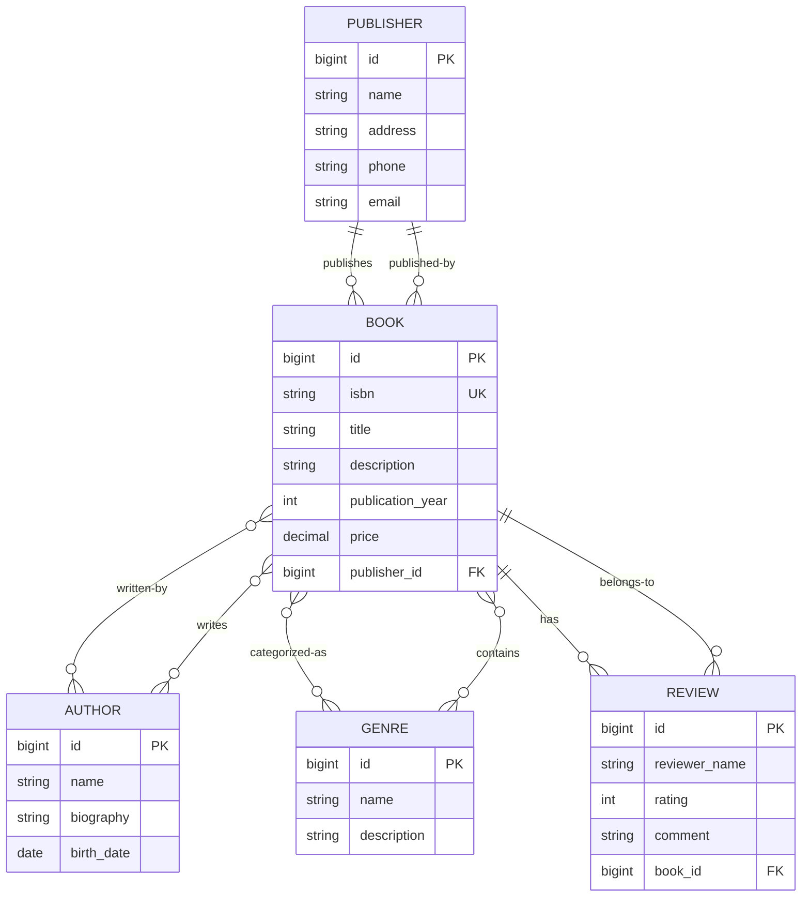

# Электронный каталог книг
## REST API проект на Java, Spring Boot, Maven

**Electronic Book Catalog** — учебное Spring Boot приложение, представляющее REST API для управления каталогом книг. Финальная цель: полноценный backend-сервис с подключением к БД, реализующий операции просмотра, поиска, сортировки и управления каталогом книг.

**Текущий статус**: реализованы получение полного каталога, различные запросы, in-memory индекс на основе `HashMap<K, V>`.

## Задачи

1. Реализовать SPA-клиент (React/Angular/Vue и т.д.).
2. Клиент должен работать с API, реализованным в лабораторных работах.
3. Отобразить связи OneToMany и ManyToMany.
4. Реализовать CRUD операции и фильтрацию.

- [SonarCloud](https://sonarcloud.io/project/overview?id=xenia777666_Electronic-Book-Catalog)
- [Swagger UI](http://localhost:8080/swagger-ui/index.html#/)

## Переменные окружения

Приложение поддерживает конфигурацию через env-переменные:

- `DB_URL` (по умолчанию `jdbc:postgresql://localhost:5432/library_db`)
- `DB_USERNAME` (по умолчанию `postgres`)
- `DB_PASSWORD` (по умолчанию `postgres`)
- `PORT` (по умолчанию `8080`)

Для локальной разработки можно использовать `.env.example` как шаблон:

```bash
cp .env.example .env
```

## Docker

### Сборка образа

```bash
docker build -t library-app:local .
```

### Запуск приложения + PostgreSQL через Docker Compose

```bash
docker compose up --build
```

После запуска API доступно на `http://localhost:8080`, healthcheck:

- `http://localhost:8080/actuator/health`

## Бесплатный PaaS (Render)

В репозитории добавлен `render.yaml` (Blueprint), который поднимает:

- web-сервис из `Dockerfile`
- PostgreSQL базу данных
- переменные окружения из managed database
- health check endpoint `/actuator/health`

Шаги:

1. Подключить репозиторий в Render.
2. Создать сервис по Blueprint (`render.yaml`).
3. Проверить публичный URL и сохранить health endpoint (например, `https://<app>.onrender.com/actuator/health`).

## CI/CD (GitHub Actions)

### CI: `.github/workflows/build.yml`

- сборка Maven
- тесты
- сборка Docker-образа
- SonarCloud (если задан `SONAR_TOKEN`)

### CD: `.github/workflows/deploy-render.yml`

- запуск deploy hook в Render
- ожидание старта
- healthcheck после развертывания

Нужно добавить GitHub Secrets:

- `RENDER_DEPLOY_HOOK_URL` — Deploy Hook URL из Render
- `RENDER_HEALTHCHECK_URL` — полный URL health endpoint
- `SONAR_TOKEN` — опционально для SonarCloud шага

## ER-диаграмма базы данных


```mermaid
erDiagram
    PUBLISHER ||--o{ BOOK : publishes
    BOOK }o--|| PUBLISHER : "published-by"
    
    BOOK }o--o{ AUTHOR : "written-by"
    AUTHOR }o--o{ BOOK : writes
    
    BOOK }o--o{ GENRE : "categorized-as"
    GENRE }o--o{ BOOK : contains
    
    BOOK ||--o{ REVIEW : has
    REVIEW }o--|| BOOK : "belongs-to"

    PUBLISHER {
        bigint id PK
        string name
        string address
        string phone
        string email
    }

    BOOK {
        bigint id PK
        string isbn UK
        string title
        string description
        int publication_year
        decimal price
        bigint publisher_id FK
    }

    AUTHOR {
        bigint id PK
        string name
        string biography
        date birth_date
    }

    GENRE {
        bigint id PK
        string name
        string description
    }

    REVIEW {
        bigint id PK
        string reviewer_name
        int rating
        string comment
        bigint book_id FK
    }
```